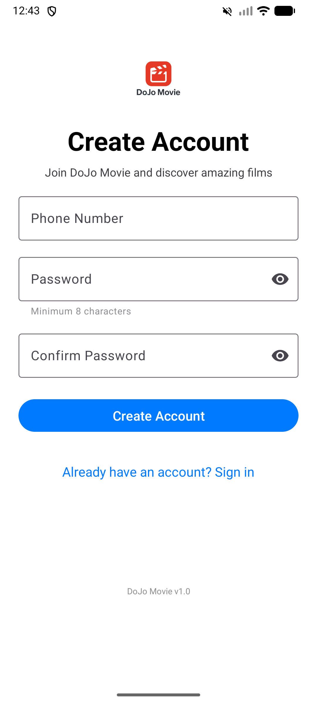
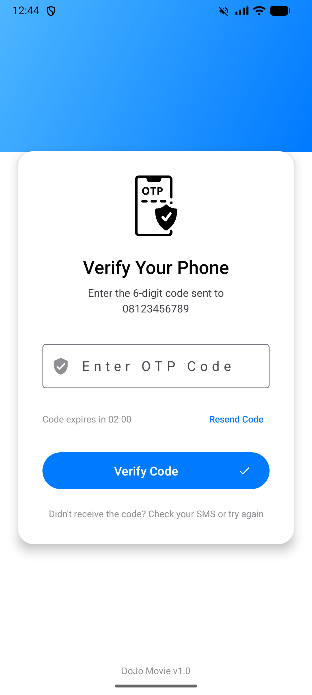
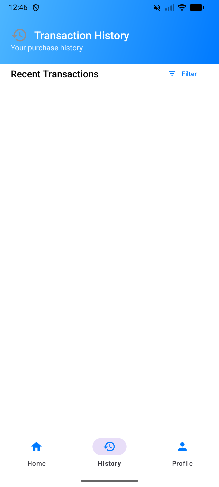

# Dojo-Movie

Android application for browsing and buying movies, built with Kotlin. This project was developed as part of the **Mobile Community Solution** course.

## Preview

| Login | Register | OTP | Home |
| :---: | :---: | :---: | :---: |
|  |  |  |  |

| Detail | History | Profile |
| :---: | :---: | :---: |
|  |  |  |

## Features

* **Authentication**: Login and Register using phone number + OTP verification.
* **Movie List**: Fetches data from a JSON API and displays it using RecyclerView.
* **Local Database**: Uses SQLite to cache movie data and store purchase history.
* **Maps Integration**: Displays the store location using Google Maps SDK.
* **Transaction Flow**: Purchase movies with real-time price calculation based on quantity.

## Tech Stack

* **Language**: Kotlin
* **Libraries**: 
    * Volley (Networking)
    * Glide (Image loading)
    * Google Play Services (Maps)
    * Material Design 3

## Setup

1. Clone this repository.
2. Open the project in Android Studio.
3. Add your `MAPS_API_KEY` to the `local.properties` file.
4. Build and run on a device (API 24+).

---
MIT License - 2026 ghtmarco
