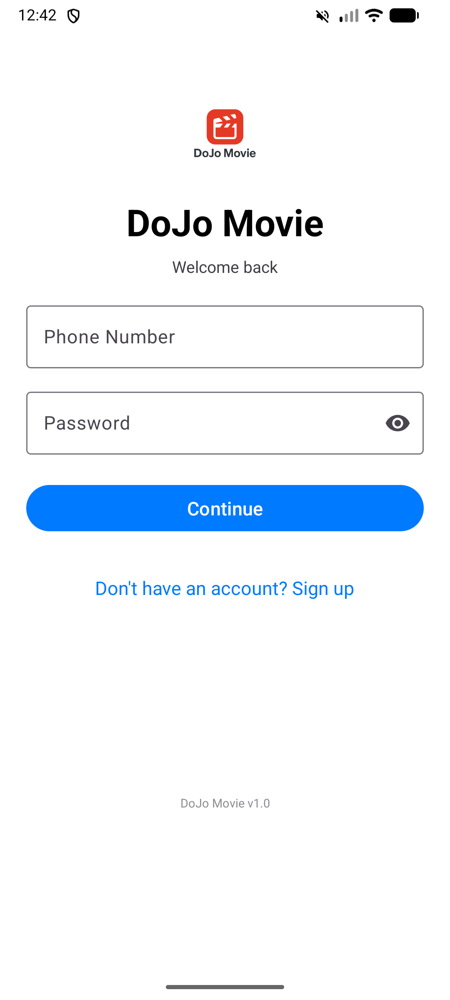
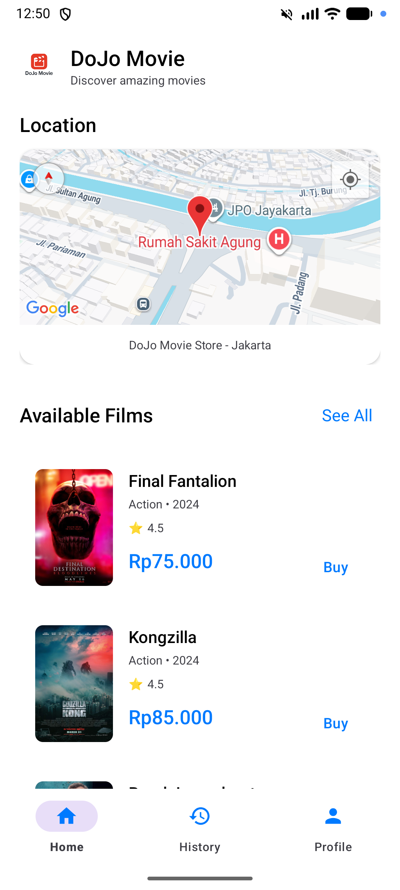
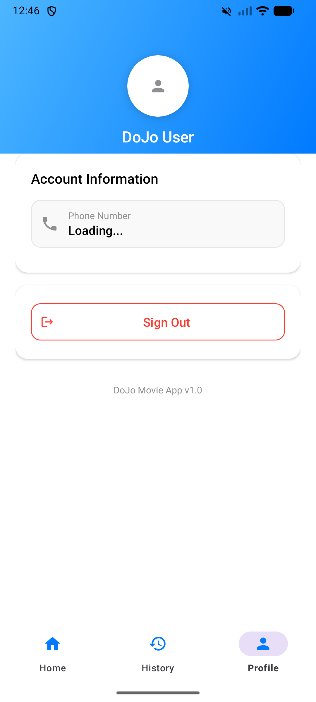

# 🎬 Dojo Movie

[](https://kotlinlang.org)
[](https://developer.android.com)
[](LICENSE)

**Dojo Movie** is a premium mobile application designed for high-quality film enthusiasts. Developed as part of the "Mobile Community Solution" course, it offers a seamless experience for browsing, purchasing, and managing your movie collection right from your Android device.

---

## ✨ Features

- 🔐 **Secure Authentication**: Register and login using your phone number with OTP (One-Time Password) verification via SMS.
- 🎞️ **Movie Catalog**: Browse a wide selection of films fetched from a live JSON API.
- 🛍️ **Smart Purchasing**: View detailed movie info, select quantities, and see real-time price updates before buying.
- 📜 **Transaction History**: Keep track of all your past purchases with detailed records.
- 📍 **Store Locator**: Find our physical store easily with integrated Google Maps and custom markers.
- 👤 **User Profile**: Manage your account and security settings with ease.

---

## 📸 Screenshots

| Login Page | Home Page | Movie Detail | History |
| :---: | :---: | :---: | :---: |
|  |  |  |  |

> *Note: Screenshots will be updated after running the app.*

---

## 🛠️ Tech Stack

- **Language**: [Kotlin](https://kotlinlang.org)
- **Networking**: [Volley](https://google.github.io/volley/) for efficient API requests.
- **Image Loading**: [Glide](https://github.com/bumptech/glide) for smooth image caching and display.
- **Database**: [SQLite](https://sqlite.org) for robust local data persistence.
- **Maps**: [Google Maps SDK](https://developers.google.com/maps/documentation/android-sdk/overview) for location services.
- **UI Framework**: [Material Design 3](https://m3.material.io) for a modern and responsive look.

---

## 🗄️ Database Schema

The application utilizes a local SQLite database with the following structure:
- `users`: Credentials and account info.
- `films`: Cached movie data from the API.
- `transactions`: Detailed purchase history for each user.

---

## 🚀 Getting Started

### Prerequisites
- Android Studio Hedgehog or newer.
- Android SDK 35 (Compile SDK).
- A valid [Google Maps API Key](https://console.cloud.google.com/).

### Installation
1. **Clone the repo**
   ```bash
   git clone https://github.com/ghtmarco/Dojo-Movie.git
   ```
2. **Setup API Key**
   Add your Google Maps API key to `local.properties`:
   ```properties
   MAPS_API_KEY=YOUR_API_KEY_HERE
   ```
3. **Build & Run**
   Open the project in Android Studio, sync Gradle, and run on an emulator or physical device (API 24+).

---

## 📄 License
This project is licensed under the MIT License - see the [LICENSE](LICENSE) file for details.
