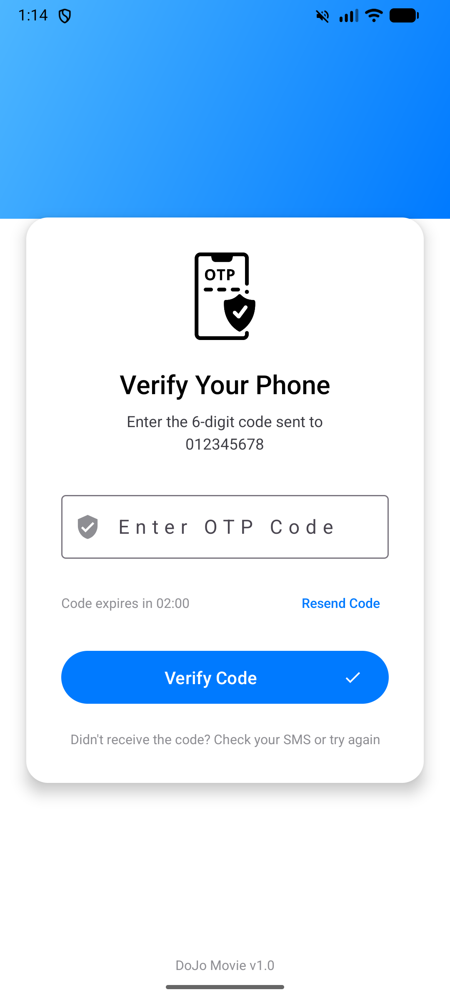
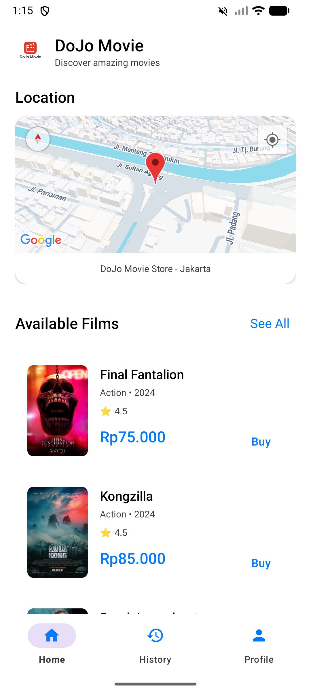
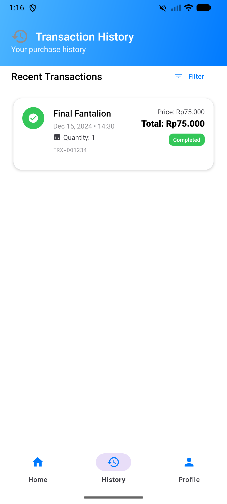
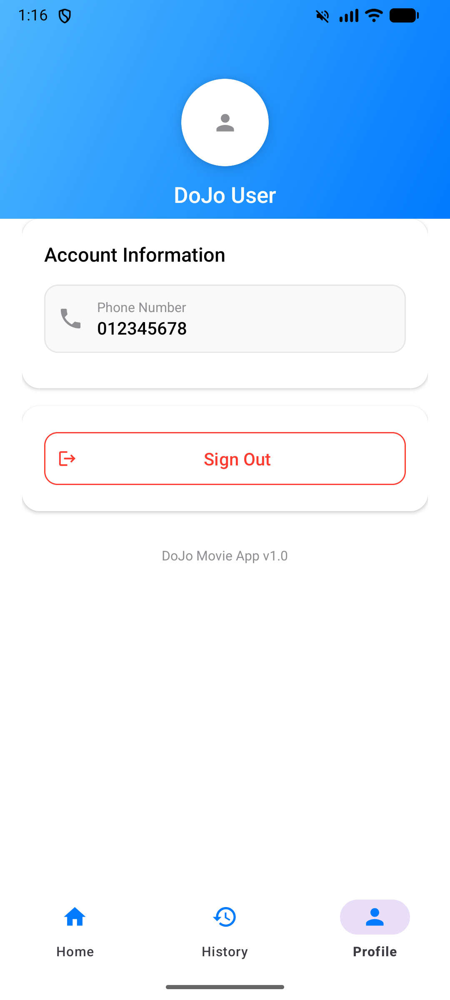

<div align="center">
  
  <h1>DoJo Movie</h1>
  <p>Android app for browsing and purchasing cinema tickets.</p>

  
  
  
  
</div>

---

## Screenshots

| Login | Register | OTP |
| :---: | :---: | :---: |
|  |  |  |

| Home | Detail | History | Profile |
| :---: | :---: | :---: | :---: |
|  |  |  |  |

## Features

- **Phone Auth** — Register and sign in using phone number + OTP verification with a 2-minute expiry window.
- **Movie Catalog** — Pulls live movie listings from a remote JSON API and renders them in a RecyclerView with Glide-loaded posters.
- **Store Locator** — Embedded Google Maps fragment pinpointing the nearest DoJo Movie store location.
- **Purchase Flow** — Select quantity, see real-time total price, and confirm checkout in a single screen.
- **Transaction History** — SQLite-backed purchase records with filter support, persisted locally across sessions.
- **Profile** — Displays the logged-in user's phone number with a sign-out option.

## Tech Stack

| Layer | Library |
|---|---|
| Language | Kotlin |
| Networking | Volley |
| Image loading | Glide 4.16 |
| Maps | Google Maps SDK 18.2 + Location 21.0 |
| UI | Material Design 3, ViewBinding |
| Storage | SQLite (via SQLiteOpenHelper) |
| Min SDK | 24 (Android 7.0) |

## Setup

1. Clone the repo and open it in **Android Studio Hedgehog or later**.
2. Add the following to your `local.properties`:
   ```
   MAPS_API_KEY=your_google_maps_api_key
   BASE_URL=your_api_base_url
   ```
3. Sync Gradle and run on a device or emulator running **API 24+**.

> Targets SDK 35. Make sure your local Android SDK includes platform 35.

## License

[MIT](LICENSE) — 2026 ghtmarco
